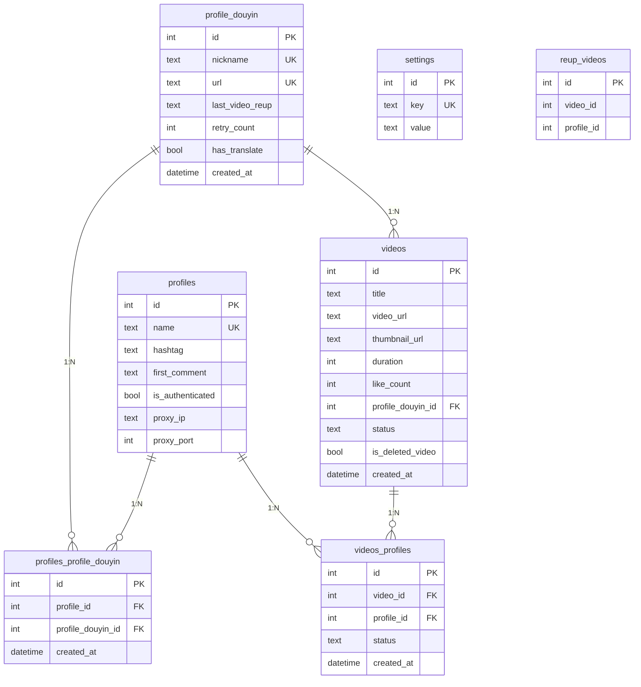

# 📖 TikTok-Wails — Tài Liệu Kỹ Thuật

## Mục Lục

- [Tổng Quan](#tổng-quan)
- [Kiến Trúc Hệ Thống](#kiến-trúc-hệ-thống)
- [Database Schema](#database-schema)
- [Module Backend](#module-backend)
  - [ProfileManager](#1-profilemanager--quản-lý-tiktok-chrome-profile)
  - [ProfileDouyinManager](#2-profiledouyinmanager--quản-lý-douyin--scrape-video)
  - [VideoManager](#3-videomanager--upload-video-lên-tiktok)
  - [SettingManager](#4-settingmanager--cài-đặt-ứng-dụng)
  - [PythonManager](#5-pythonmanager--dịch-video)
  - [Scheduler](#6-scheduler--tự-động-hóa)
  - [CAPTCHA Solver](#7-captcha-solver--giải-captcha-douyin)
  - [Chrome Helper](#8-chrome-helper--quản-lý-browser)
  - [Logger](#9-logger--ghi-log)
- [Frontend](#frontend)
- [Luồng Xử Lý Chính](#luồng-xử-lý-chính)

---

## Tổng Quan

**TikTok-Wails** là ứng dụng desktop tự động hóa việc reup video từ **Douyin** (TikTok Trung Quốc) sang **TikTok** quốc tế. Được xây dựng bằng [Wails v2](https://wails.io/) — kết hợp Go backend với React frontend.

### Tính Năng Chính

| Tính năng | Mô tả |
|-----------|-------|
| **Quản lý Chrome Profile** | Tạo/quản lý nhiều TikTok account qua Chrome profiles riêng biệt |
| **Quản lý Douyin Profile** | Theo dõi nhiều kênh Douyin để scrape video |
| **Liên kết Profile** | Kết nối Douyin profile với Chrome profile (nhiều-nhiều) |
| **Tự động scrape video** | Duyệt Douyin API để lấy video mới từ các kênh đã theo dõi |
| **Tự động upload TikTok** | Upload video đã scrape lên TikTok qua browser automation |
| **Giải CAPTCHA tự động** | Dùng OpenCV (gocv) giải captcha dạng puzzle slide |
| **Dịch phụ đề** | Dịch audio tiếng Trung → phụ đề tiếng Việt (Whisper + MarianMT) |
| **Lịch tự động** | Pipeline tuần tự chạy hàng ngày: Scrape → Upload → Xóa → Kiểm tra |

### Tech Stack

```
Backend:   Go 1.24 + Wails v2
Frontend:  React + TypeScript + Tailwind CSS + shadcn/ui
Database:  SQLite (modernc.org/sqlite - pure Go)
Browser:   chromedp (Chrome DevTools Protocol)
CV:        gocv (OpenCV bindings)
AI/ML:     Python Flask + Whisper + MarianMT (dịch thuật)
```

---

## Kiến Trúc Hệ Thống

```
┌─────────────────────────────────────────────────────┐
│                    Wails Desktop App                │
├──────────────────────┬──────────────────────────────┤
│    React Frontend    │         Go Backend           │
│  ┌────────────────┐  │  ┌────────────────────────┐  │
│  │ Profile Tab    │  │  │ initialize/             │  │
│  │ Douyin Tab     │◄─┼─►│   server.go  (entry)   │  │
│  │ Video Tab      │  │  │   database.go (schema) │  │
│  │ Settings Tab   │  │  │   schedule.go (jobs)   │  │
│  └────────────────┘  │  │   logger.go   (logs)   │  │
│         ▲            │  │   global.go   (config) │  │
│         │ Wails      │  └────────────────────────┘  │
│         │ Bindings   │  ┌────────────────────────┐  │
│         └────────────┼─►│ manage/service/        │  │
│                      │  │   (interfaces)         │  │
│                      │  ├────────────────────────┤  │
│                      │  │ manage/implement/      │  │
│                      │  │   profile.go           │  │
│                      │  │   profile_douyin.go    │  │
│                      │  │   profile_lib.go       │  │
│                      │  │   video.go             │  │
│                      │  │   setting.go           │  │
│                      │  │   python.go            │  │
│                      │  │   chrome_helper.go     │  │
│                      │  └────────────────────────┘  │
├──────────────────────┴──────────────────────────────┤
│  SQLite (wails.db)    │    Python Flask (:9230)     │
└───────────────────────┴─────────────────────────────┘
```

### Luồng Khởi Động

```
main.go
  └─► InitServer()
        ├─► InitLogger()      // Khởi tạo dual log (stdout + file)
        ├─► InitDatabase()    // Tạo bảng + indexes + seed settings
        ├─► InitGlobal()      // Load settings → global variables
        ├─► InitManage()      // Khởi tạo tất cả service managers
        └─► InitSchedule()    // Bắt đầu pipeline scheduler
```

---

## Database Schema



### Indexes

| Index | Bảng | Cột | Mục đích |
|-------|------|-----|----------|
| `idx_ppd_profile_id` | profiles_profile_douyin | profile_id | Tìm Douyin profiles theo Chrome profile |
| `idx_ppd_douyin_id` | profiles_profile_douyin | profile_douyin_id | Tìm Chrome profiles theo Douyin profile |
| `idx_videos_douyin_id` | videos | profile_douyin_id | Tìm video theo Douyin profile |
| `idx_videos_status` | videos | status | Filter video theo trạng thái |
| `idx_videos_url` | videos | video_url | Kiểm tra duplicate video |
| `idx_vp_video_id` | videos_profiles | video_id | Tìm profile đã upload video |
| `idx_vp_profile_id` | videos_profiles | profile_id | Tìm video đã upload cho profile |

---

## Module Backend

### 1. ProfileManager — Quản Lý TikTok Chrome Profile

**File:** `manage/implement/profile.go`
**Interface:** `service.ProfileManagerInterface`

Quản lý các Chrome profile, mỗi profile tương ứng với **1 tài khoản TikTok**. Chrome profile lưu session/cookies giúp duy trì đăng nhập.

#### Các Method

| Method | Mô tả |
|--------|-------|
| `AddProfile(name, hashtag, firstComment, proxyIP, proxyPort)` | Tạo profile mới, tự động mở Chrome để login TikTok |
| `UpdateProfile(id, ...)` | Cập nhật thông tin profile |
| `DeleteProfile(id)` | Xóa profile và tất cả liên kết |
| `GetAllProfiles()` | Lấy danh sách tất cả profiles |
| `GetAllProfileCheckAuthenticated()` | Lấy profiles cần kiểm tra auth |
| `ConnectWithProfileDouyin(profileId, douyinIds)` | Liên kết profile với nhiều Douyin profiles |
| `UpdateAuthenticatedStatus(id, status)` | Cập nhật trạng thái xác thực |

#### Luồng Xử Lý AddProfile

```
AddProfile("account1", "#viral", "Comment", "1.2.3.4", "8080")
  │
  ├─► BEGIN TRANSACTION
  ├─► INSERT vào bảng profiles
  ├─► Gọi LoginTiktok("account1")
  │     └─► Mở Chrome với UserDataDir riêng
  │         └─► Navigate tới tiktok.com → User login thủ công
  ├─► Cập nhật is_authenticated = true/false
  └─► COMMIT
```

---

### 2. ProfileDouyinManager — Quản Lý Douyin & Scrape Video

**File:** `manage/implement/profile_douyin.go`
**Interface:** `service.ProfileDouyinInterface`

Module phức tạp nhất — xử lý scrape video từ Douyin thông qua headless Chrome.

#### Các Method

| Method | Mô tả |
|--------|-------|
| `AddProfile(nickname, url)` | Thêm Douyin profile, tự động test truy cập |
| `UpdateProfile(id, nickname, url)` | Cập nhật thông tin |
| `DeleteProfile(id)` | Xóa profile |
| `GetAllProfiles()` | Lấy tất cả Douyin profiles |
| `AccessProfile(profile)` | Test truy cập Douyin profile (headless) |
| `GetVideoFromProfile(profile)` | **Scrape video mới** từ Douyin |
| `UpdateLastVideoReup(id, lastVideoReup)` | Đánh dấu video cuối cùng đã reup |
| `GetAllProfileDouyinFromProfile(profileId)` | Lấy Douyin profiles liên kết với Chrome profile |
| `ToggleHasTranslate(id)` | Bật/tắt tính năng dịch cho profile |

#### Luồng Xử Lý GetVideoFromProfile

```
GetVideoFromProfile(douyinProfile)
  │
  ├─ 1. Mở headless Chrome (HeadlessChromeOpts)
  │     └─ UserDataDir = os.TempDir()/nickname
  │
  ├─ 2. Navigate tới trang Douyin profile
  │     └─ URL: https://www.douyin.com/user/{url}
  │
  ├─ 3. Chờ trang load + xử lý CAPTCHA
  │     ├─ Kiểm tra có CAPTCHA slide không
  │     ├─ Nếu có → gọi PuzzleCaptchaSolver.Discern()
  │     │    ├─ Download ảnh background + slide
  │     │    ├─ RemoveWhitespace (threshold + findContours)
  │     │    ├─ ApplyEdgeDetection (Canny)
  │     │    ├─ FindPositionOfSlide (Template Matching)
  │     │    └─ Trả về vị trí X pixel
  │     └─ Di chuyển slider tới vị trí tìm được
  │
  ├─ 4. Intercept network requests (CDP)
  │     └─ Bắt response từ API: /aweme/v1/web/aweme/post/
  │
  ├─ 5. Parse JSON response
  │     └─ Extract: title, video_url, thumbnail, duration, likes
  │
  ├─ 6. Filter video mới (so sánh với last_video_reup)
  │
  ├─ 7. Download video files
  │     └─ Lưu vào thư mục videos/
  │
  ├─ 8. Insert vào database (kiểm tra duplicate theo video_url)
  │     ├─ INSERT INTO videos
  │     └─ INSERT INTO videos_profiles (cho mỗi connected profile)
  │
  └─ 9. Cập nhật last_video_reup
```

---

### 3. VideoManager — Upload Video Lên TikTok

**File:** `manage/implement/video.go`
**Interface:** `service.VideoManagerInterface`

Xử lý upload video lên TikTok thông qua Chrome automation.

#### Các Method

| Method | Mô tả |
|--------|-------|
| `LoginTiktok(temdir)` | Mở Chrome để verify TikTok session |
| `UploadVideo(profile, video, title)` | **Upload video lên TikTok** |
| `AddVideo(title, url, thumb, ...)` | Thêm video vào DB (kiểm tra duplicate) |
| `GetAllVideos(page, pageSize)` | Phân trang danh sách video |
| `GetAllVideosNP()` | Lấy tất cả video (không phân trang) |
| `GetVideoReup(profileId)` | Lấy video chưa reup cho profile |
| `UpdateStatusReup(videoId, profileId, status)` | Cập nhật trạng thái reup |
| `CreateConnectWithProfile(profileId, videoId)` | Liên kết video với profile |
| `DeleteVideo(video)` | Xóa video file + DB record |
| `GetCompleteProfileVideos(videoId)` | Đếm số profile chưa upload video |

#### Luồng Xử Lý UploadVideo

```
UploadVideo("account1", "video_title", "Title #hashtag")
  │
  ├─ 1. Mở Chrome (VisibleChromeOpts)
  │     └─ UserDataDir = PathTempProfile/account1
  │     └─ Language = vi-VN
  │
  ├─ 2. Navigate tới TikTok Studio Upload
  │     └─ https://www.tiktok.com/tiktokstudio/upload?from=webapp
  │
  ├─ 3. Upload file video
  │     └─ chromedp.SetUploadFiles('input[type="file"]', [videoPath])
  │     └─ File path: videos/{video_title}
  │
  ├─ 4. Chờ upload hoàn tất (Sleep 30s)
  │
  ├─ 5. Nhập tiêu đề
  │     ├─ Focus vào editor: div[contenteditable]
  │     ├─ Clear nội dung cũ (Ctrl+A, Backspace)
  │     └─ Gõ tiêu đề mới
  │
  ├─ 6. Click nút "Đăng"
  │     └─ Selector: button (chứa text "Đăng")
  │
  └─ 7. Chờ hoàn thành (Sleep 10s)
```

#### Luồng Xử Lý AddVideo (Duplicate Prevention)

```
AddVideo(title, videoURL, ...)
  │
  ├─ SELECT id FROM videos WHERE video_url = ?
  │    ├─ Tìm thấy → return video hiện có (skip insert)
  │    └─ Không tìm thấy → tiếp tục insert
  │
  └─ INSERT INTO videos (...) VALUES (...)
```

---

### 4. SettingManager — Cài Đặt Ứng Dụng

**File:** `manage/implement/setting.go`
**Interface:** `service.SettingInterface`

Hệ thống key-value store cho cài đặt, lưu trong bảng `settings`.

#### Các Method

| Method | Mô tả |
|--------|-------|
| `GetAllSettings()` | Trả về `map[string]string` tất cả settings |
| `GetSetting(key)` | Lấy value theo key |
| `SetSetting(key, value)` | Insert hoặc update setting (UPSERT) |

#### Default Settings

| Key | Default Value | Mô tả |
|-----|---------------|-------|
| `path_chrome` | `C:/Program Files/Google/Chrome/Application/chrome.exe` | Đường dẫn Chrome |
| `schedule_time` | `daily` | Kiểu lịch chạy |
| `run_at_time` | `24` | Giờ bắt đầu pipeline (24 = tắt) |

---

### 5. PythonManager — Dịch Video

**File:** `manage/implement/python.go`
**Interface:** `service.PythonInterface`

Giao tiếp với Python Flask server để dịch audio tiếng Trung → phụ đề tiếng Việt.

#### Luồng Xử Lý TranslateVideo

```
TranslateVideo(videoId)
  │
  ├─ 1. Query database: SELECT title FROM videos WHERE id = ?
  │
  ├─ 2. Tạo video path: {PathVideoReup}/{title}.mp4
  │
  ├─ 3. POST http://localhost:9230/translate-video
  │     └─ Body: {"video_path": "path/to/video.mp4"}
  │
  └─ 4. Python Flask xử lý:
        ├─ Whisper: Audio → Text (tiếng Trung)
        ├─ MarianMT: Text → Dịch sang tiếng Việt
        ├─ Tạo file .ass (phụ đề)
        └─ FFmpeg: Ghép phụ đề vào video
```

#### Python Flask Server (`python-app/translate.py`)

```
Port: 9230
Endpoint: POST /translate-video
Models:
  - Whisper "base" (nhận diện giọng nói)
  - Helsinki-NLP/opus-mt-zh-vi (dịch Trung → Việt)
Output: video-sub.mp4 (video có phụ đề)
```

---

### 6. Scheduler — Tự Động Hóa

**File:** `initialize/schedule.go`

Pipeline tuần tự — chạy hàng ngày vào giờ H (cấu hình trong settings).

```
                  Giờ H
                    │
    ┌───────────────▼───────────────┐
    │  Job 1: Scrape Douyin Videos  │
    │  - Duyệt tất cả Douyin profiles
    │  - Lấy video mới qua API     │
    │  - Download + lưu database   │
    │  - Parallel (WaitGroup)      │
    └───────────────┬───────────────┘
                    │ xong → tiếp
    ┌───────────────▼───────────────┐
    │  Job 2: Upload TikTok Videos  │
    │  - Lấy video chưa upload     │
    │  - Upload qua Chrome cho     │
    │    từng profile               │
    │  - Cập nhật status = "done"  │
    └───────────────┬───────────────┘
                    │ xong → tiếp
    ┌───────────────▼───────────────┐
    │  Job 3: Delete Completed      │
    │  - Tìm video đã upload hết   │
    │  - Xóa file + database       │
    └───────────────┬───────────────┘
                    │ xong → tiếp
    ┌───────────────▼───────────────┐
    │  Job 4: Check Authentication  │
    │  - Verify TikTok session      │
    │  - Đánh dấu profile hết hạn │
    └───────────────┬───────────────┘
                    │
                Sleep 1h → quay lại đầu
```

**Đặc điểm:**
- Dùng `waitUntilHour()` tính chính xác thời gian chờ (không polling)
- `recover()` cho mỗi job — 1 job panic không crash pipeline
- `WaitGroup` cho Job 1 (scrape song song nhiều profiles)
- Job 2-4 chạy tuần tự trong mỗi profile

---

### 7. CAPTCHA Solver — Giải CAPTCHA Douyin

**File:** `manage/implement/profile_lib.go`
**Struct:** `PuzzleCaptchaSolver`

Giải captcha dạng **puzzle slide** của Douyin bằng OpenCV (gocv).

#### Thuật Toán

```
Input: Ảnh background (có lỗ trống) + Ảnh slide (mảnh ghép)
Output: Vị trí X (pixel) cần kéo slide tới

Bước 1: RemoveWhitespace(slideImage)
  └─ Threshold binary inverse (>250 = white → 0, else → 255)
  └─ FindContours → BoundingRect → Crop

Bước 2: ApplyEdgeDetection(slideImage)
  └─ GrayScale → Canny Edge Detection (100, 200)

Bước 3: ApplyEdgeDetection(backgroundImage)
  └─ Tương tự bước 2

Bước 4: FindPositionOfSlide(edgeSlide, edgeBg)
  └─ MatchTemplate (TmCcoeffNormed)
  └─ MinMaxLoc → maxLoc.X = vị trí slide
```

---

### 8. Chrome Helper — Quản Lý Browser

**File:** `manage/implement/chrome_helper.go`

Cung cấp 3 helper functions cho chromedp options, tránh duplicate code.

| Function | Headless | Flags bổ sung | Dùng cho |
|----------|----------|---------------|----------|
| `DefaultChromeOpts(userDataDir, headless)` | Param | Base flags | Base function |
| `HeadlessChromeOpts(userDataDir)` | `true` | logging, disable-web-security | Douyin scraping |
| `VisibleChromeOpts(userDataDir)` | `false` | lang=vi-VN | TikTok upload/login |

---

### 9. Logger — Ghi Log

**File:** `initialize/logger.go`

Dual output — ghi log ra cả **stdout** (development) và **file** (production).

```
Log directory: ~/TiktokReupVM/logs/
Log file:      YYYY-MM-DD.log
Format:        2006/01/02 15:04:05 file.go:123: message
```

---

## Frontend

### Stack

```
React 18 + TypeScript + Tailwind CSS + shadcn/ui
```

### Cấu Trúc Tabs

| Tab | Component | Mô tả |
|-----|-----------|-------|
| Quản lý Profile Chrome | `account-tab.tsx` | CRUD Chrome profiles, xem trạng thái auth |
| Quản lý Profile Douyin | `profile-douyin-tab.tsx` | CRUD Douyin profiles, liên kết profiles |
| Quản lý Video | `video-tab.tsx` | Xem videos, phân trang, status badges |
| Cài đặt | `settings-tab.tsx` | Load/save settings từ backend |

### Wails Bindings

Frontend gọi backend qua auto-generated TypeScript bindings:

```typescript
// Ví dụ sử dụng
import { GetAllProfiles, AddProfile } from "../../wailsjs/go/backend/App"

const profiles = await GetAllProfiles()
await AddProfile("account1", "#viral", "First!", "1.2.3.4", "8080")
```

---

## Luồng Xử Lý Chính

### Luồng Hoàn Chỉnh: Từ Douyin → TikTok

```
1. User thêm Chrome Profile (TikTok account)
   └─► Chrome mở → User login TikTok → Lưu session

2. User thêm Douyin Profile (kênh muốn theo dõi)
   └─► Test access → Verify kênh tồn tại

3. User liên kết: Chrome Profile ↔ Douyin Profile
   └─► INSERT vào profiles_profile_douyin

4. Scheduler chạy (hoặc thủ công):

   Job 1: Scrape
   ├─► Mở headless Chrome
   ├─► Navigate tới Douyin profile
   ├─► Giải CAPTCHA (nếu có)
   ├─► Intercept API response
   ├─► Parse video list
   ├─► Filter video mới (sau last_video_reup)
   ├─► Download video files
   └─► Lưu database + cascade tạo videos_profiles entries

   Job 2: Upload
   ├─► Lấy video pending cho mỗi Chrome profile
   ├─► Mở Chrome (visible) → TikTok Studio
   ├─► Upload file + nhập tiêu đề + hashtag
   ├─► Click "Đăng"
   └─► Cập nhật status = "done"

   Job 3: Cleanup
   ├─► Tìm video đã upload xong trên tất cả profiles
   └─► Xóa file + soft delete DB

   Job 4: Auth Check
   ├─► Mở Chrome → TikTok
   ├─► Kiểm tra session còn valid
   └─► Đánh dấu expired profiles
```
